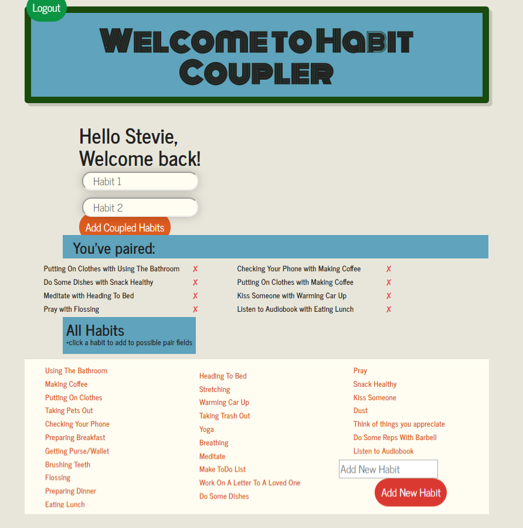

# Habit Coupler

## About / Synopsis

* A full stack app for helping you stop making your habits stand alone
* Project status: working/prototype
* Techs used: Bootstrap, MongoDB/Mongoose, Restful APIs, MVC architecture, ExpressJS, NodeJS, Firebase AUTH

* User, you will need Firebase AUTH Keys for the app to function.  Get these at: https://firebase.google.com/docs/auth

